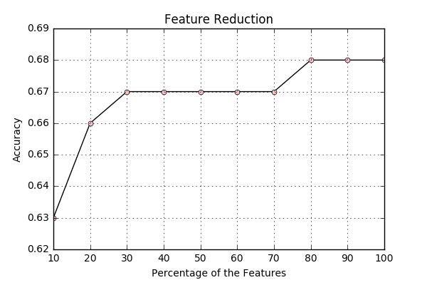
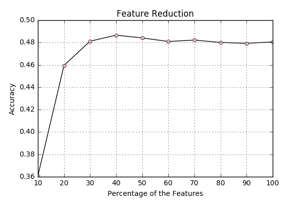

# Impact of Category Field

The general purpose of this project is improving the accuracy of automatic categorization so that the amount of man hours needed to classify product nuts can be reduced. In some cases these product nuts have already been 'classified' by their source. This blog update investigates whether these categories attached by outside sources can improve the accuracy significantly. Because the run time is also an important factor, two methods are investigated. The first is attaching the catgory as a token, training the data, and reducing the features with feature reduction. The second setting the category as the only token. 

** First Step: Adding Category to Tokens **
The first thing that is done is that the category is attached to the tokens in the following manner:

```
def f_categories(j):
    if j.get('categories', '') == '': return []
    
    categories = []
    for x in j.get('categories', ''):
        categories.extend(x.split(' '))
        
    categories = [clean(c) for c in categories]
    return categories
```

Then only those product nuts with a category are selected and subjected to the pipeline constructed in previous blog posts. 
At 100% of the features the accuracy is ```0.68 (+/- 0.05)```. This is quite the improvement from the standard accuracy - 64%.  

The amount of features at this time is 21497, and the amount of product nuts with a category is 66739. Usually the amount of product nuts is 121662, so the amount of product nuts with a category is 54%. 
To reduce the amount of features, feature reduction is used which results in the following graphs. 



On the validation set this results in the following recall scores:

```
micro recall score:  0.770644335892
macro recall score:  0.603302387268
```

** Second Step: Let Category be the only Token **
Instead of adding the tokens to the already existing tokens for each product nut, the category is the only token attached to a product nut. This is done with the following code:

```
def f_categories(j):
    if j.get('categories', '') == '': return []
    
    categories = []
    for x in j.get('categories', ''):
        categories.extend(x.split(' '))
        
    categories = [clean(c) for c in categories]
    return categories

def tok(data):
    '''Returns a dict including the tokens, usage and product_id for all products nuts'''
    id_tokens = []
    for j in data:

        tokens = f_categories(j)
        tokens = filter(lambda s: s not in STOPWORDS, tokens)
        tokens = filter(lambda s: len(s) > 1, tokens)
        
        id_tokens.append({'id': j['id'], 'tokens': tokens, 'usage':j['usage'], 'product_id':j['product_id']})
        
    return id_tokens
```

This results in a accuracy of 0.48% (+/- 0.03%) for 100% of the features. This means there are 2524 features compared to the 21469 features when the categories are added. This is however only on 3679 product nuts, compared to 66721 product nuts in step 1. The accuracy of this step with feature reduction is displayed below. 

```
Accuracy Linear SVC 10: 0.36 (+/- 0.04)
Accuracy Linear SVC 20: 0.46 (+/- 0.03)
Accuracy Linear SVC 30: 0.48 (+/- 0.03)
Accuracy Linear SVC 40: 0.49 (+/- 0.02)
Accuracy Linear SVC 50: 0.48 (+/- 0.03)
Accuracy Linear SVC 60: 0.48 (+/- 0.03)
Accuracy Linear SVC 70: 0.48 (+/- 0.02)
Accuracy Linear SVC 80: 0.48 (+/- 0.03)
Accuracy Linear SVC 90: 0.48 (+/- 0.03)
Accuracy Linear SVC 100: 0.48 (+/- 0.03)
```




** Conclusion **
In conclusion:
step 1 trains on 66721 product nuts and has 21469 features - this results in a macro recall of 60%.
step 2 trains on 3679 product nuts and has 2524 features - this results in a macro recall of 


** Extra **
Furthermore to investigate the features that are or are not important the following code is included in both steps. 

```
reduced = SelectPercentile(percentile=1)
reduced.fit(X_TRAIN, Y_TRAIN)
list_of_features = reduced.get_support()

index_removed = []
for x in enumerate(list_of_features):
    if x[1] != True:
        index_removed.append(x[0])
        
flipped_vocab = {v: k for k, v in vocab.iteritems()}

list_removed = []
for n in index_removed:
    list_removed.append(flipped_vocab[n])
    
set(vocab.keys()) - set(list_removed)
```

Which results in a list of the 1% most important features. By varying the value for percentile to any value n between 1 and 100 you can check the n% most important features. 

Because one of the questions during our meeting was about the importance of sugar and salt, I investigated if they were important. For step 2 sugar and salt are both in the top 1% of important features, and in step 1 they are both in the top 2%. It turns out sugar and salt is crucial in correctly classifying product nuts. 


